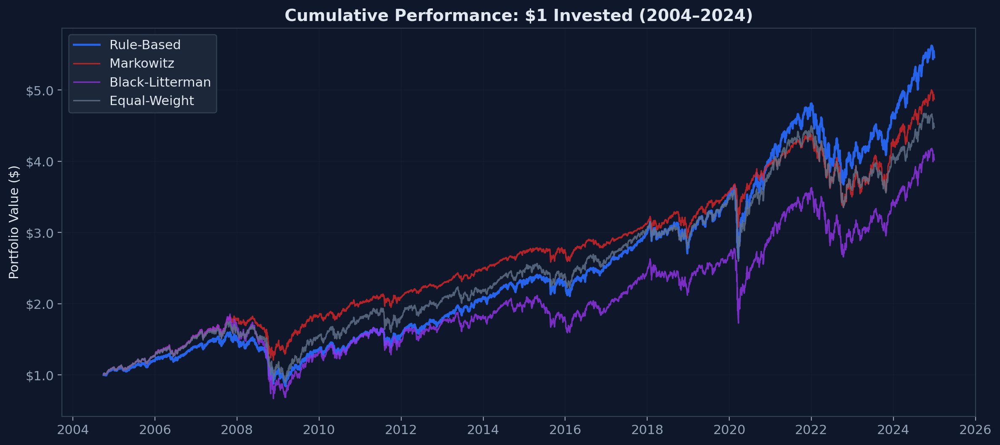
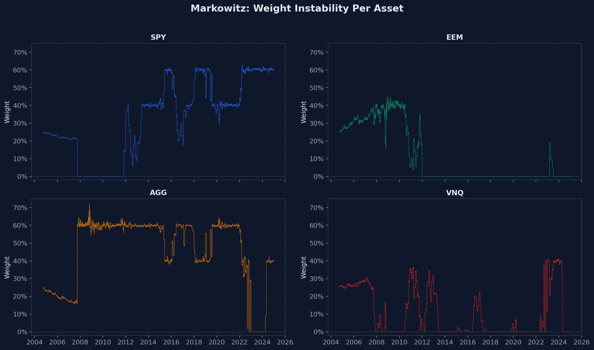

# Why the Boring Portfolio Wins

Empirical comparison of Markowitz Mean-Variance, Black-Litterman, and rule-based portfolio construction on 20 years of real ETF data.

**Thesis:** Rule-based construction doesn't win *despite* its simplicity — it wins *because of it*. Regulation, explainability, and scalability aren't constraints on the optimization problem. They are the optimization problem.



## Results

Four ETFs (SPY, EEM, AGG, VNQ), daily data from 2004 to 2024. All three methods run on identical data with identical constraints.

|                   | Rule-Based | Markowitz | Black-Litterman | Equal-Weight |
|-------------------|-----------|-----------|-----------------|--------------|
| **CAGR**          | **8.76%** | 8.15%     | 7.12%           | 7.70%        |
| Volatility        | 15.89%    | **11.83%**| 23.27%          | 16.77%       |
| Sharpe Ratio      | 0.425     | **0.520** | 0.220           | 0.340        |
| Max Drawdown      | 47.41%    | **33.99%**| 63.94%          | 48.58%       |
| Annual Turnover   | **101.91%** | 223.36% | 236.38%         | 152.21%      |
| Rebalance Count   | **211**   | 677       | 501             | 445          |
| Tracking Error    | **0.95%** | 7.45%     | 8.70%           | 4.10%        |

Markowitz has the best Sharpe — by concentrating everything into SPY + AGG and dropping EEM and VNQ to 0%. Good luck explaining that to a regulator.

### Transaction Cost Impact

At realistic trading costs of 10–20 basis points, the gap widens:

|                   | CAGR drag @ 20 bps |
|-------------------|--------------------|
| **Rule-Based**    | **−0.01 pp**       |
| Markowitz         | −0.23 pp           |
| Black-Litterman   | −0.28 pp           |

Markowitz loses 23× more to transaction costs than rule-based. Black-Litterman loses 28×.

### Why the Optimizer Fails



The Markowitz optimizer sets EEM and VNQ to 0% for years, then suddenly allocates 60% to a single asset, then reverses. This is the well-documented instability of mean-variance optimization when fed estimated (not true) covariance matrices. Every rebalance is a trade. Every trade costs money. And none of these allocation swings are explainable to a client or auditor.

## Why This Matters for Robo-Advisors

A platform serving 400,000 retail clients across 875 white-label tenants (think: German Volksbanken) needs portfolio construction that is:

- **Auditable** — BaFin can review the decision logic
- **Explainable** — "70% equities, 30% bonds" beats "the covariance matrix implied..."
- **Scalable** — no per-portfolio optimization at rebalancing time
- **Compliant** — MiFID II suitability assessments require transparent reasoning
- **Cost-efficient** — low turnover = low transaction costs at scale

Rule-based construction satisfies all five. The optimization-based approaches satisfy one (Markowitz: cost-efficient via low volatility) or none.

## Project Structure

```
├── src/
│   ├── data_loader.py          # Yahoo Finance download + validation
│   ├── synthetic_data.py       # Fallback data for CI/sandboxed environments
│   ├── rule_based.py           # Fixed allocation + threshold rebalancing
│   ├── markowitz.py            # Rolling mean-variance optimization
│   ├── black_litterman.py      # Market prior + momentum views
│   ├── metrics.py              # CAGR, Sharpe, MaxDD, Turnover, Tracking Error
│   └── visualize.py            # All charts
├── scripts/
│   └── run_benchmark.py        # Single entry point → runs everything
├── results/
│   ├── figures/                # Generated PNGs
│   └── summary_*.csv           # Metrics at 0, 10, 20 bps
├── data/
│   ├── raw/                    # Yahoo Finance downloads (gitignored)
│   └── processed/              # Cleaned prices + returns
├── GLOSSARY.md                 # Financial terms explained for developers
└── article/                    # Full article (EN + DE)
```

## Quick Start

```bash
# Clone and install
git clone https://github.com/<handle>/portfolio-construction-benchmark.git
cd portfolio-construction-benchmark
python -m venv .venv && source .venv/bin/activate
pip install -e .

# Download data and run benchmark
python -m src.data_loader
python -m scripts.run_benchmark

# Generate charts
python -m src.visualize
```

Requires Python 3.12+. Data is downloaded from Yahoo Finance on first run.

## Configuration

All parameters are exposed as function arguments — no config files, no magic.

| Parameter | Default | Where |
|-----------|---------|-------|
| `target_weights` | 60/15/20/5 | `rule_based.run()` |
| `threshold` | ±5% | `rule_based.run()` |
| `check_frequency` | 63 days (quarterly) | `rule_based.run()` |
| `lookback` | 756 days (3 years) | `markowitz.run()`, `black_litterman.run()` |
| `rebalance_frequency` | 21 days (monthly) | `markowitz.run()`, `black_litterman.run()` |
| `max_weight` | 60% | `markowitz.run()`, `black_litterman.run()` |
| `view_confidence` | 0.25 | `black_litterman.run()` |
| `transaction_cost_bps` | 0 | all three |

## Glossary

For financial terms used in this project, see [GLOSSARY.md](GLOSSARY.md).

## License

Code: [MIT](LICENSE)
Article and figures: [CC BY 4.0](LICENSE-ARTICLE)
