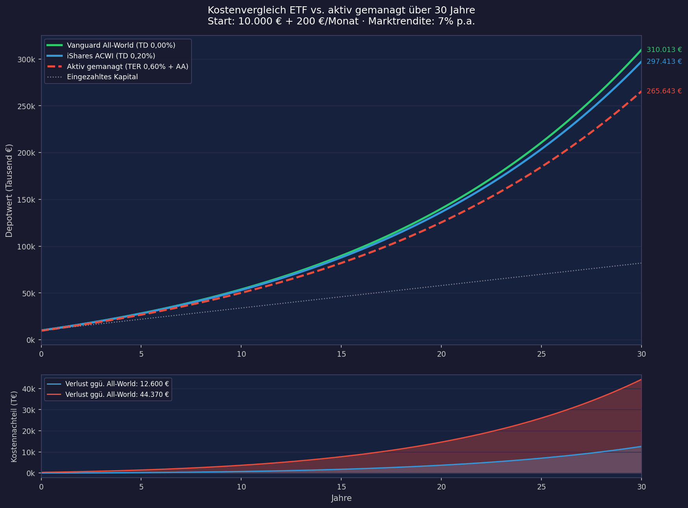
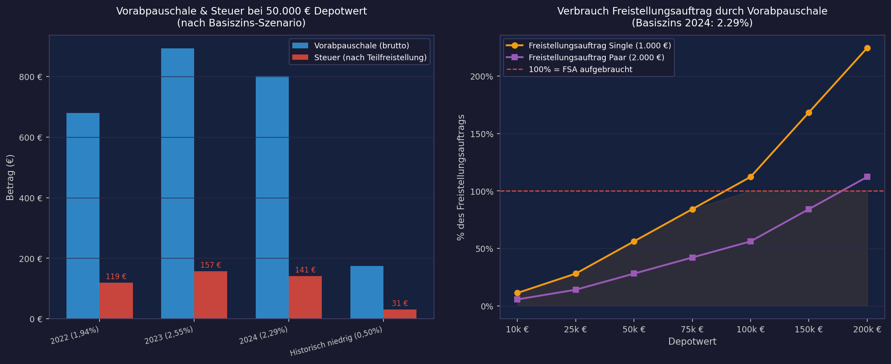

# ETF-Grundlagen: Der ehrliche Praxisguide

> **Hinweis:** Ich bin kein Finanzberater. Dieser Artikel ersetzt keine professionelle Beratung und begründet keine Haftung. Alle Zahlen sind Beispielrechnungen auf Basis historischer Daten – zukünftige Renditen sind nicht garantiert.

---

## Warum dieser Artikel existiert

Ich habe in letzter Zeit immer wieder die gleichen Fragen gehört. Von Freunden, Bekannten, Arbeitskollegen. Alle haben irgendwann von ETFs gehört, viele haben schon recherchiert – und trotzdem stehen sie vor denselben Fragen: Wo fange ich an? Welchen ETF nehme ich? Wie viel streue ich? Und was ist das eigentlich mit der Vorabpauschale?

Das Problem mit den meisten Artikeln zu diesem Thema: Sie sind entweder zu oberflächlich ("Einfach einen MSCI World kaufen!") oder sie verdienen an deiner Entscheidung – durch Affiliate-Links, Provisionen oder gesponserte Empfehlungen.

Ich verdiene an diesem Artikel nichts. Ich habe selbst die gleiche Lernkurve hinter mir, und dieser Text ist das, was ich mir damals gewünscht hätte.

Was ich voraussetze: Du weißt grob, was ein ETF ist. Du hast vielleicht schon den Begriff MSCI World gehört. Du hast aber noch kein Depot und bist unsicher, wie du anfangen sollst. Genau dafür ist dieser Artikel.

Für wen dieser Artikel nicht geeignet ist: Wer in den nächsten zwei Jahren Eigenkapital für eine Immobilie braucht, wer Konsumschulden mit hohen Zinsen hat, oder wer Marktschwankungen grundsätzlich nicht aushält – für diese Situationen ist ein Aktien-ETF-Sparplan der falsche erste Schritt.

---

## 1. Was ein ETF eigentlich ist – und was nicht

Ein **ETF (Exchange Traded Fund)** ist ein Investmentfonds, der an der Börse gehandelt wird und automatisch einen Index nachbildet. Kein Mensch entscheidet, welche Aktien gekauft werden – das Regelwerk des Index entscheidet es.

Das klingt abstrakt, wird aber sofort klar wenn man es mit den Alternativen vergleicht:

Ein **aktiver Fonds** hat einen Fondsmanager, der versucht den Markt zu schlagen. Er kauft und verkauft Aktien nach eigener Einschätzung. Dafür kostet er deutlich mehr – und schafft es trotzdem in der überwältigenden Mehrzahl der Fälle langfristig *nicht*, besser abzuschneiden als ein simpler Index-ETF. Dazu kommen wir später noch mit konkreten Zahlen.

Eine **Einzelaktie** ist ein Anteil an einem einzigen Unternehmen. Wenn das Unternehmen gut läuft, profitierst du stark. Wenn es schlecht läuft – oder pleite geht – verlierst du alles, was du dort investiert hast. Ein ETF auf einen breiten Index hält stattdessen Anteile an Hunderten oder Tausenden Unternehmen gleichzeitig.

### Wie ein ETF den Index nachbildet

Es gibt zwei Methoden:

**Physische Replikation** bedeutet, der ETF kauft tatsächlich die Aktien, die im Index enthalten sind. Kaufst du einen ETF auf den MSCI World, hält der Fonds echte Aktien von Apple, Microsoft, Nestlé und so weiter. Transparent und intuitiv nachvollziehbar.

**Synthetische Replikation** funktioniert über sogenannte Swaps – Tauschgeschäfte mit einer Bank. Der ETF hält nicht unbedingt die eigentlichen Index-Aktien, sondern vereinbart mit einer Gegenpartei (meist einer Investmentbank), die Index-Rendite zu liefern. Das klingt komplizierter als es ist: Für den Anleger macht es in der Praxis meist kaum einen Unterschied. Historisch konnten synthetische ETFs bei US-Dividenden steuerlich leicht im Vorteil sein – seit der Investmentsteuerreform 2018 sind diese Unterschiede jedoch deutlich geringer geworden. Das Gegenparteirisiko ist durch regulatorische Vorgaben auf 10% des Fondsvermögens begrenzt.

Für Einsteiger gilt: Greif im Zweifel zur physischen Replikation – sie ist verständlicher und das Swap-Risiko ist in der Praxis gering, aber unnötige Komplexität braucht niemand am Anfang.

### Ausschüttend oder thesaurierend?

Ein ETF kann Dividenden und Zinserträge, die er aus den enthaltenen Aktien erhält, auf zwei Arten behandeln:

**Ausschüttend:** Die Erträge werden regelmäßig auf dein Konto überwiesen. Du siehst Geld fließen – was sich gut anfühlt, aber steuerlich sofort relevant ist.

**Thesaurierend:** Die Erträge werden automatisch reinvestiert. Kein Geldeingang, keine Entscheidung – der Zinseszinseffekt arbeitet ungebremst weiter.

Für einen langfristigen Sparplan ist thesaurierend in den meisten Fällen die bessere Wahl. Der Grund ist simpel: Jeder Euro, der ausgeschüttet wird, muss sofort versteuert werden. Jeder Euro, der im Fonds verbleibt und weiter Rendite erwirtschaftet, wird erst später besteuert – und hat bis dahin mehr Zeit zu wachsen. Dazu kommen wir im Steuerkapitel nochmal konkret.

---

## 2. Der Index entscheidet alles: Welchen ETF kaufen?

Die wichtigste Entscheidung beim ETF-Kauf ist nicht der ETF selbst – es ist der Index, den er abbildet. Zwei ETFs auf den gleichen Index sind fast austauschbar. Zwei ETFs auf verschiedene Indizes können sich dramatisch unterscheiden.

### Die drei großen Welt-Indizes

**MSCI World**
Trotz des Namens bildet dieser Index *nicht* die ganze Welt ab. Er umfasst etwa 1.500 Unternehmen aus 23 Industrieländern – also entwickelte Volkswirtschaften wie USA, Europa, Japan. Schwellenländer wie China, Indien oder Brasilien sind *nicht* enthalten. Die USA machen rund 70% des Index aus.

**MSCI ACWI (All Country World Index)**
Dieser Index erweitert den MSCI World um Schwellenländer (Emerging Markets) und umfasst damit rund 2.900 Unternehmen aus 47 Ländern. Deutlich breiter, aber die Emerging-Markets-Gewichtung liegt nur bei etwa 10–12%.

**FTSE All-World**
Ähnlich wie der MSCI ACWI, aber mit einem anderen Anbieter (FTSE Russell statt MSCI) und mit rund 4.200 Unternehmen noch etwas breiter gefasst. Auch hier sind Schwellenländer enthalten.

| Index | Länder | Unternehmen | Emerging Markets |
|---|--:|--:|---|
| MSCI World | 23 | ~1.500 | Nein |
| MSCI ACWI | 47 | ~2.900 | Ja (~11%) |
| FTSE All-World | 49 | ~4.200 | Ja (~12%) |

**Meine Empfehlung:** Für die meisten Menschen ist ein ETF auf den FTSE All-World oder MSCI ACWI die bessere Wahl als ein reiner MSCI World. Der Grund ist nicht, dass Emerging Markets zwingend besser performen – das ist ungewiss. Sondern dass du mit einem echten Welt-ETF eine vollständigere Marktabdeckung bekommst, ohne aktiv Länder auszuschließen.

### Konkrete ETFs – worauf du achtest

Wenn du weißt welchen Index du willst, gibt es oft mehrere ETFs darauf. Die Entscheidung zwischen ihnen hängt von vier Faktoren ab:

**TER (Total Expense Ratio):** Die jährliche Gesamtkostenquote – das, was der ETF-Anbieter für die Verwaltung berechnet. Wird automatisch aus dem Fondsvermögen entnommen, du siehst es nicht als separate Abbuchung.

**Trackingdifferenz (TD):** Das ist wichtiger als die TER. Die TD ist die tatsächliche Abweichung der ETF-Rendite vom Index über ein Kalenderjahr – gemessen als Differenz zwischen ETF-Rendite und Index-Rendite. Ein ETF mit 0,20% TER kann trotzdem eine TD von 0,0% oder sogar negativ haben.

Negativ bedeutet: Der ETF hat seinen eigenen Index *übertroffen*. Das klingt paradox, ist aber real – und hat einen konkreten Grund: Viele ETFs verleihen ihre gehaltenen Aktien gegen Gebühr an andere Marktteilnehmer (z.B. Leerverkäufer). Diese Wertpapierleihe-Erträge fließen in den Fonds zurück und können die Verwaltungskosten teilweise oder vollständig kompensieren. Bei synthetischen ETFs kann ein günstiges Swap-Pricing denselben Effekt haben.

Wichtig: Die TD ist vergangenheitsbezogen und nicht garantiert wiederholbar – sie ist ein Indikator für die Qualität des Fondsmanagements, kein Versprechen. Die TER bleibt der planbare Fixkostenfaktor, die TD zeigt wie gut der ETF damit in der Vergangenheit umgegangen ist. Quelle für historische TD-Daten: [trackingdifferences.com](https://www.trackingdifferences.com).

**Fondsgröße (AUM – Assets under Management):** Ein ETF mit sehr wenig Fondsvolumen läuft Gefahr, geschlossen zu werden. Ab etwa 100 Millionen Euro Volumen ist ein ETF praktisch stabil. Die großen ETFs auf populäre Indizes haben mehrere Milliarden – kein Thema.

**Replikation:** Physisch oder synthetisch – wie oben erklärt.

Welche konkreten ETFs auf diese Kriterien am besten abschneiden – inklusive einer vollständigen Analyse aller Welt-ETFs mit negativer Tracking Difference – zeigt das nächste Kapitel.

---

## 3. ETF-Auswahl im Detail: Alle Welt-ETFs mit negativer Tracking Difference

Für Leser, die tiefer einsteigen wollen, folgt hier die vollständige Analyse: alle thesaurierenden Welt-ETFs, die ihren Index tatsächlich geschlagen haben.

### Methodik und Bereinigung

Die folgende Auswahl basiert auf einer extraETF-Filterung aller thesaurierenden Welt-ETFs mit negativer Tracking Difference (1-Jahres-TD). Die Rohdaten wurden nach folgenden Kriterien bereinigt:

**Ausgeschlossen** wurden währungsgesicherte ETFs (Hedged CHF/EUR), deren extrem negative TD-Werte (bis −11%) aus Hedging-Gewinnen durch Zinsdifferenzen stammen und nicht mit ungesicherten ETFs vergleichbar sind. Bei Umkehr der Zinsdifferenz schlägt dieser Effekt ins Negative um. Ebenso ausgeschlossen: ETFs in Nicht-USD-Basiswährungen (SGD, EUR-notierte Duplikate), bei denen die TD durch Währungseffekte verzerrt ist, sowie Faktor- und Strategie-ETFs (Value, Equal Weight, High Dividend, ESG-Screened), die bewusst einen anderen Index abbilden und in eine eigene Analyse gehören.

Übrig bleiben **13 Plain-Vanilla-ETFs** in USD, die breite Industrieländer- oder Weltindizes abbilden.

### Wie ein ETF seinen Index schlagen kann

Im vorigen Kapitel hast du gelesen, dass eine negative TD bedeutet: Der ETF hat seinen Index übertroffen. Drei Mechanismen machen das möglich:

**Wertpapierleihe.** Der Fonds verleiht Aktien an institutionelle Gegenparteien (etwa für Leerverkäufe) und kassiert Leihgebühren. Bei den großen MSCI-World-ETFs liegen die Einnahmen typischerweise bei 0,02–0,05% p.a. – genug, um einen Teil der TER zu kompensieren.

**Optimiertes Sampling.** Kein physischer ETF hält alle 1.400+ Titel des MSCI World in exakter Gewichtung. Die Indexabteilungen der Anbieter wählen eine repräsentative Teilmenge, die durch geschicktes Gewichten den Index sogar leicht übertreffen kann.

**Steuerliche Optimierung.** Quellensteuer-Rückforderungen und die Nutzung von Doppelbesteuerungsabkommen senken die effektiven Kosten. Der Index rechnet mit pauschalen Quellensteuersätzen; der Fondsmanager kann oft weniger zahlen.

Die TD aggregiert alle diese Effekte in einer einzigen Zahl. Ein ETF mit TER 0,12% und TD −0,15% hat effektiv Geld *verdient* gegenüber dem Index. Ein ETF mit TER 0,05% und TD +0,10% hat trotz niedrigerer Gebühren *schlechter* abgeschnitten.

### Die bereinigte Auswahl

| Rang | Fondsname | Replikation | TER | AUM (Mio €) | Positionen | TD |
|-----:|-----------|:-----------:|----:|------------:|-----------:|-----:|
| 1 | Amundi Prime Global | physisch | 0,05% | 1.150 | 1.381 | −0,21% |
| 2 | HSBC MSCI World | physisch | 0,15% | 1.540 | 1.280 | −0,18% |
| 3 | Invesco FTSE All-World | physisch | 0,15% | 2.440 | 2.349 | −0,16% |
| 4 | SPDR MSCI World | physisch | 0,12% | 14.850 | 1.311 | −0,15% |
| 5 | Vanguard FTSE Developed World | physisch | 0,12% | 5.050 | 1.991 | −0,14% |
| 6 | Xtrackers MSCI World ex USA | physisch | 0,15% | 5.130 | 775 | −0,13% |
| 7 | Xtrackers MSCI World | physisch | 0,12% | 16.780 | 1.321 | −0,09% |
| 8 | Amundi Core MSCI World | physisch | 0,12% | 12.450 | 1.318 | −0,08% |
| 9 | SPDR MSCI ACWI IMI | physisch | 0,17% | 4.460 | 4.398 | −0,05% |
| 10 | iShares MSCI World Swap | synthetisch | 0,12% | 971 | — | −0,28% |
| 11 | UBS MSCI ACWI SF (synth.) | synthetisch | 0,21% | 1.960 | — | −0,39% |
| 12 | Scalable MSCI AC World Xtrackers | synthetisch | 0,17% | 470 | — | −0,30% |
| 13 | Amundi MSCI World Swap II | synthetisch | 0,30% | 480 | — | −0,08% |

*Sortierung nach Replikationsart, dann TD. AUM-Daten gerundet. Quelle: extraETF, Stand März 2026.*

### Die Platzhirsche

SPDR MSCI World (TD −0,15%), Vanguard FTSE Developed World (TD −0,14%) und Xtrackers MSCI World (TD −0,09%) bilden das erwartbare Spitzenfeld. Alle drei haben TER 0,12%, massive Fondsvolumina (5–17 Mrd. €) und jahrelange Track Records. Die Unterschiede zwischen ihnen sind marginal – wer einen der drei bespart, macht nichts falsch.

Bemerkenswert: Alle drei schlagen ihren Index trotz 0,12% Kosten. Die Wertpapierleihe-Einnahmen und steuerlichen Optimierungen überkompensieren die TER vollständig.

### Preis-Leistungs-Sieger: Amundi Prime Global

Mit TER 0,05% ist der Amundi Prime Global der günstigste ETF im gesamten Feld. Dass er zusätzlich eine TD von −0,21% liefert, macht ihn zum effizientesten Produkt der Auswahl: 26 Basispunkte besser als der Index, bei nur 5 Basispunkten Kosten. Mit 1,15 Mrd. € AUM ist er deutlich kleiner als die Platzhirsche – aber weit über der kritischen Schwelle von 100 Mio. €.

Wichtig zu wissen: Der Amundi Prime Global bildet den Solactive GBS Developed Markets Large & Mid Cap Index ab, nicht den MSCI World. In der Praxis sind die Unterschiede vernachlässigbar (beide ca. 1.400 Titel, >99% Korrelation), aber die TD ist streng genommen nicht direkt mit MSCI-World-ETFs vergleichbar, da ein anderer Referenzindex zugrunde liegt.

### Die Breitesten: Invesco FTSE All-World und SPDR MSCI ACWI IMI

Wer nicht nur Industrieländer, sondern auch Schwellenländer in einem einzigen ETF abdecken will, hat zwei Kandidaten:

Der **Invesco FTSE All-World** (2.349 Positionen, TD −0,16%) bildet den FTSE All-World Index ab und enthält ca. 10% Emerging Markets. Der **SPDR MSCI ACWI IMI** (4.398 Positionen, TD −0,05%) bildet den MSCI ACWI Investable Market Index ab und enthält zusätzlich Small Caps – der breiteste ETF im gesamten Feld.

Beide sind eine echte Ein-ETF-Lösung für den gesamten Aktienmarkt. Wer in Kapitel 2 die Empfehlung "FTSE All-World oder MSCI ACWI" gelesen hat: Hier sind die konkreten Kandidaten mit negativer TD.

### Sonderfall: Xtrackers MSCI World ex USA

Mit 5,13 Mrd. € AUM und TD −0,13% ist der Xtrackers MSCI World ex USA kein klassischer Welt-ETF, sondern ein gezieltes Instrument für Anleger, die ihr US-Exposure separat steuern wollen. Bei einem US-Anteil von ca. 70% im MSCI World kann die Kombination aus einem S&P-500-ETF und diesem Produkt eine bewusste Gewichtungssteuerung ermöglichen. Für Buy-and-Hold-Anleger mit einem einzigen ETF ist er nicht die erste Wahl.

### Synthetische Replikation: Swap-ETFs

Vier ETFs in der Auswahl nutzen synthetische Replikation. Ihr Vorteil: tendenziell bessere TD-Werte, weil der Swap-Partner die Quellensteuer-Optimierung übernimmt und die Index-Rendite direkt garantiert. Ihr Nachteil: Kontrahentenrisiko – bei Ausfall des Swap-Partners greift die Besicherung, aber das Restrisiko ist nicht null. Das Kontrahentenrisiko ist regulatorisch auf 10% des Fondsvermögens begrenzt (wie in Kapitel 1 erklärt).

Die stärksten Swap-Kandidaten sind iShares MSCI World Swap (TD −0,28%, TER 0,12%) und UBS MSCI ACWI SF (TD −0,39%, TER 0,21%). Der Scalable MSCI AC World Xtrackers und Amundi MSCI World Swap II sind mit kleinerem AUM die schwächeren Optionen.

### Entscheidungshilfe

**"Ich will einen ETF, über den ich nie wieder nachdenken muss."**
→ SPDR MSCI World, Vanguard FTSE Developed World oder Xtrackers MSCI World. Riesiges Volumen, bewährt, jahrelang negative TD.

**"Ich will maximale Kosteneffizienz."**
→ Amundi Prime Global. TER 0,05%, TD −0,21%. Kein anderer ETF liefert so viel Rendite pro Euro Kosten.

**"Ich will die ganze Welt in einem ETF – inklusive Emerging Markets."**
→ SPDR MSCI ACWI IMI (breiteste Abdeckung, inkl. Small Caps) oder Invesco FTSE All-World (schlanker, bessere TD).

**"Ich kann Swap-Risiko einordnen und will maximale TD-Effizienz."**
→ iShares MSCI World Swap oder UBS MSCI ACWI SF.

### Was diese Tabelle nicht zeigt

Die Tracking Difference ist eine historische Kennzahl – sie beschreibt das letzte Jahr, nicht die Zukunft. Ein ETF mit TD −0,15% kann nächstes Jahr bei −0,05% oder +0,02% landen. Die Persistenz negativer TDs über mehrere Jahre ist das relevantere Signal. Wer tiefer einsteigen will, vergleicht die TD über 3–5 Jahre auf [trackingdifferences.com](https://www.trackingdifferences.com).

Ebenfalls nicht abgebildet: Spread (Geld-Brief-Spanne beim Kauf/Verkauf), Steuersitz des Fonds (Irland vs. Luxemburg), und die Sparplan-Verfügbarkeit beim eigenen Broker. Für einen Sparplan-Anleger, der 300 € monatlich investiert, kann ein ETF mit 0,02% schlechterem Spread teurer sein als einer mit 0,05% schlechterer TD.

---

## 4. Was kleine Kostenunterschiede über die Zeit anrichten

Hier wird es konkret – und das ist der Teil, der die meisten überrascht.

0,2% Unterschied in der jährlichen Kostenquote klingt nach nichts. Über 30 Jahre macht es einen Unterschied von mehr als 12.000 Euro. Das ist kein theoretisches Rechenspiel – das ist Geld, das du tatsächlich nicht bekommst.

Die folgende Berechnung zeigt drei Szenarien mit 10.000 € Startkapital und 200 € monatlicher Sparrate bei 7% Marktrendite p.a.:

**Nach 30 Jahren:**
- Vanguard FTSE All-World (TD ~0,00%): **310.013 €**
- iShares MSCI ACWI (TD ~0,20%): **297.413 €** → 12.600 € weniger
- Aktiv gemanagtes Depot / Robo-Advisor (Beispiel: ~0,60% Gesamtkosten + 3% Ausgabeaufschlag auf Einzelpositionen): **265.643 €** → 44.370 € weniger

Eine kurze Anmerkung zur verwendeten Rendite: Die historische Rendite des MSCI World lag nominal bei rund 8–9% p.a. – klingt viel. Zieht man die durchschnittliche Inflation ab (Deutschland 2004–2024: ~1,4% p.a.), bleibt eine reale Kaufkraftrendite von etwa 7% p.a. Die 7%, die wir in den Berechnungen verwenden, sind also bereits ein konservatives reales Bild, kein optimistisches nominales.

Der Ausgabeaufschlag – ein einmaliger Aufschlag von 3–5% auf jede Einzahlung, den manche aktiv gemanagten Fonds erheben – ist besonders tückisch: Er trifft nicht nur das Startkapital, sondern jeden einzelnen Beitrag. 200 € monatlich werden damit zu 194 €, die tatsächlich investiert werden. Der Rest landet beim Anbieter.

Das untere Panel im Chart zeigt, wann der Kostennachteil wirklich spürbar wird: erst nach Jahr 10 ist der Abstand deutlich sichtbar, nach Jahr 20 wird er dramatisch. Das erklärt, warum viele Leute den Schaden zu spät bemerken.

---

## 5. Streuung: Reicht ein ETF oder brauche ich mehrere?

Kurze Antwort: Für die meisten Menschen reicht **ein** ETF auf den FTSE All-World oder MSCI ACWI vollständig aus.

Etwas längere Antwort:

### 1-ETF-Lösung
Ein einziger All-World ETF enthält Tausende Unternehmen aus Dutzenden Ländern, quer durch alle Branchen. Die Streuung ist enorm. Du musst nichts manuell gewichten, nichts rebalancen, nichts entscheiden. Kaufen und liegenlassen.

### 2-ETF-Lösung (70/30)
Manche Anleger kombinieren einen MSCI World ETF (Industrieländer) mit einem MSCI Emerging Markets ETF und gewichten sie etwa 70/30. Das gibt mehr Kontrolle über die Emerging-Markets-Quote – der ACWI hat nur ~11%, manche wollen mehr. Der Nachteil: Du musst gelegentlich rebalancen, wenn die Gewichtung durch unterschiedliche Performance auseinanderdriftet. Einmal jährlich prüfen und bei mehr als 5% Abweichung anpassen reicht völlig – das kostet aber Zeit, manchmal Gebühren, und erzeugt ggf. Steuerereignisse.

### Was du weglassen kannst

**Faktor-ETFs** (Value, Momentum, Quality, Low Volatility) sind ETFs, die gezielt bestimmte Aktiencharakteristika übergewichten. Die akademische Forschung dahinter ist real – aber die Umsetzung für Einsteiger unnötig komplex. Nicht weil sie schlechter performen müssen, sondern weil du mehrere davon kombinieren und verstehen müsstest, warum sie sich in bestimmten Marktphasen anders verhalten.

**Themen-ETFs und ESG** taugen nicht als Kern des Depots – aus unterschiedlichen Gründen.

ESG-ETFs schließen Energie- und Rüstungsaktien aus, die 2022–2024 zu den stärksten Sektoren gehörten – mit entsprechendem Performancenachteil. Dazu kommt: ESG-Ratings verschiedener Anbieter korrelieren kaum miteinander. Was als "nachhaltig" gilt, ist weniger Wissenschaft als Marketing.

KI-Themen-ETFs leiden am klassischen Timing-Problem: Wer 2023 oder 2024 einstieg, zahlte bereits nach einem erheblichen Run entsprechend hohe Bewertungen. Und wer einen MSCI World oder FTSE All-World hält, ist über Nvidia, Microsoft und Alphabet ohnehin schon signifikant in KI exponiert – marktgewichtet, ohne Klumpenrisiko. Ein separater KI-ETF ist dann meistens eine teure Dopplung. Hinzu kommt das Grundproblem für Einsteiger: Einen Hype früh genug zu erkennen ist nahezu unmöglich. Wenn ein Thema in den Mainstream-Medien ankommt, haben institutionelle Anleger die Gewinne längst gemacht.

**Fazit:** Fang mit einem ETF an. Wenn du nach ein paar Jahren das Bedürfnis nach mehr Kontrolle spürst, kannst du immer noch erweitern.

---

> **Bevor du loslegst: Drei Fragen zur Selbsteinschätzung**
>
> **Anlagehorizont:** Geld das du in weniger als 5 Jahren brauchst – für ein Auto, eine Anzahlung, einen Puffer – gehört nicht in Aktien-ETFs. Märkte können über mehrere Jahre im Minus bleiben. Das ist kein Risiko, sondern Mechanik.
>
> **Notgroschen:** Bevor du investierst, solltest du 3–6 Monatsausgaben liquide auf einem Tagesgeldkonto haben. Der Sparplan darf nicht dazu führen, dass du im Notfall ETFs mit Verlust verkaufen musst.
>
> **Schulden:** Wer Konsumkredite oder Kreditkartenschulden mit 8–15% Zinsen hat, sollte diese zuerst tilgen. Ein ETF-Sparplan mit erwarteten 7% realer Rendite ergibt rechnerisch keinen Sinn, solange er gegen 12% Schuldzinsen läuft.

---

---

## 6. Depot eröffnen: Wo und warum

Du kannst den besten ETF der Welt ausgewählt haben – wenn dein Broker dich jedes Mal 10 € für den Kauf berechnet, frisst das bei kleinen Sparraten einen beachtlichen Teil der Rendite. Broker-Wahl ist also keine Kleinigkeit.

### Deutsche Broker im Überblick

| Broker | Sparplan-Gebühr | ETF-Auswahl | Charakter |
|---|---|---|---|
| Trade Republic | 0 € | gut | App-only, Neobroker |
| Scalable Capital | 0 € (Free Broker) | sehr gut | App + Web, Giro möglich |
| ING | 0 € ab 1 € Sparrate | gut | Klassische Direktbank |
| Comdirect | ab 1,50% | sehr gut | Volle Funktionalität |

**Trade Republic** ist die einfachste Einstiegsoption – die App ist intuitiv, Sparpläne kostenlos, und es gibt aktuell Zinsen auf nicht investiertes Cash. Nachteil: reine App, kein Web-Interface, und als Neobroker regulatorisch anders aufgestellt als eine klassische Bank.

**Scalable Capital** ist etwas komplexer, bietet aber mehr ETF-Auswahl und ein optionales Giro-Konto. Der Free Broker reicht für Sparpläne aus, das Prime-Abo lohnt sich erst bei häufigen Einzelkäufen.

**ING** ist die klassische Alternative für alle, die lieber mit einer etablierten Bank arbeiten und nicht auf eine App angewiesen sein wollen.

**Comdirect** ist sinnvoll für komplexere Setups – wenn du z.B. Optionen oder ausländische Börsen brauchst. Für einen einfachen ETF-Sparplan ist sie überdimensioniert.

**Kurze Anmerkung zu Neobroker-Risiken:** Trade Republic und Scalable sind regulierte Wertpapierfirmen und unterliegen der BaFin-Aufsicht. Deine Wertpapiere sind als Sondervermögen geschützt – sie gehören rechtlich dir, nicht dem Broker, und sind im Insolvenzfall nicht Teil der Insolvenzmasse. Das Geld auf dem Verrechnungskonto (nicht in ETFs investiert) ist bis 100.000 € durch die gesetzliche Einlagensicherung geschützt.

### Internationale Situation: Wenn ein Wohnsitzwechsel möglich ist

Wer in Betracht zieht, ins Ausland zu ziehen – oder Verwandte im Ausland hat, die mitinvestieren wollen – sollte die Broker-Wahl von Anfang an anders angehen. Ein nachträglicher Depot-Übertrag ins Ausland ist aufwändig und kann steuerliche Konsequenzen haben. Außerdem sperren oder schränken manche deutschen Broker Konten ein, wenn der Wohnsitz in bestimmte Länder wechselt.

**Interactive Brokers (IBKR)** ist in dieser Situation die erste Wahl: Multi-Währungs-Depot, in sehr vielen Ländern verfügbar, integriertes Steuerreporting, und kein Problem bei Wohnsitzwechsel. Die Oberfläche ist auf Englisch und deutlich komplexer als ein deutscher Neobroker – für rein-deutsche Verhältnisse ist das Overkill. Sobald aber eine internationale Dimension absehbar ist, lohnt sich IBKR von Anfang an. Ein späterer Wechsel kostet mehr.

---

## 7. Steuer – der Teil, den alle überspringen

Steuern sind kein Grund, nicht zu investieren. Aber wer sie ignoriert, verschenkt Geld.

### Freistellungsauftrag: Unbedingt einrichten

Kapitalerträge (Dividenden, realisierte Gewinne, Vorabpauschale) sind in Deutschland steuerpflichtig. Die ersten **1.000 € pro Person** (Stand 2026) sind jedoch steuerfrei – das ist der sogenannte Sparerpauschbetrag. Bei Paaren verdoppelt sich das auf 2.000 €.

Damit dieser Freibetrag automatisch angewendet wird, musst du bei deinem Broker einen **Freistellungsauftrag** einrichten. Das geht in der App oder im Online-Banking in wenigen Minuten. Wenn du das nicht machst, zieht der Broker Abgeltungssteuer auf alle Erträge ein – und du musst sie dir später über die Steuererklärung zurückholen.

Hast du mehrere Depots oder Konten, kannst du den Freibetrag aufteilen (z.B. 600 € bei Broker A, 400 € bei Broker B) – solange die Gesamtsumme 1.000 € nicht übersteigt.

**Aktion:** Freistellungsauftrag einrichten ist das Erste, was du nach Depot-Eröffnung machst. Vor dem ersten ETF-Kauf.

### Vorabpauschale: Kein Drama, aber man sollte sie kennen

Thesaurierende ETFs schütten nichts aus – aber das Finanzamt möchte trotzdem jährlich etwas. Dafür gibt es die **Vorabpauschale**: eine Art fiktiver Mindestbesteuerung, die sicherstellen soll, dass Wertzuwächse nicht endlos steuerfrei wachsen.

Die Berechnung ist etwas technisch, aber das Prinzip ist einfach:

1. Der Staat legt jährlich einen **Basiszins** fest (2026: 3,20%)
2. Daraus errechnet sich ein **Basisertrag**: Fondswert × Basiszins × 0,7
3. Dieser Basisertrag gilt als fiktiver Ertrag – sofern der ETF tatsächlich so viel oder mehr gewachsen ist
4. 30% davon sind steuerfrei (Teilfreistellung für Aktienfonds)
5. Auf den Rest fällt Abgeltungssteuer an (~26,375% inkl. Soli)

Klingt kompliziert. In der Praxis läuft es so: Anfang des Jahres zieht der Broker automatisch den fälligen Betrag vom Verrechnungskonto ab. Du musst nichts selbst berechnen. Du solltest aber genug Liquidität auf dem Konto haben.

Konkret für ein 50.000 € Depot bei Basiszins 2026:

| | |
|---|---|
| Basisertrag | 50.000 × 3,20% × 0,7 = **1.120,00 €** |
| Steuerpflichtig (nach 30% Teilfreistellung) | 784,00 € |
| Steuer (~26,375%) | **~207 €** |

Das interaktive Tool zeigt, wie sich das für verschiedene Depotwerte und Basiszins-Szenarien verändert.

**Praktischer Hinweis zur Liquidität:** Bei einem Basiszins von 3,20% solltest du pro 10.000 € Depotwert etwa 35–40 € auf dem Verrechnungskonto bereithalten (mit Kirchensteuer 36–38 €). Die Abbuchung erfolgt automatisch am ersten Bankarbeitstag im Januar des Folgejahres – wer kein Guthaben hat, riskiert, dass der Broker Fondsanteile verkauft.

Wichtig: Wenn dein Freistellungsauftrag noch nicht ausgeschöpft ist, wird die Vorabpauschale zunächst darüber verrechnet. Bei 50.000 € Depotgröße werden bereits etwa 78% des Single-Freistellungsauftrags durch die Vorabpauschale beansprucht – bevor eine einzige Dividende oder ein Verkauf stattfindet. Das ist ein häufig unterschätzter Effekt.

Und ein Punkt der viele Einsteiger beruhigt: Die gezahlte Vorabpauschale wird beim späteren Verkauf auf die dann fällige Steuer angerechnet. Du zahlst also nicht doppelt – die Vorabpauschale ist eine Vorauszahlung auf die spätere Schlussabrechnung, keine zusätzliche Belastung.

### Ausschüttend vs. thesaurierend – nochmal aus Steuerperspektive

Ein ausschüttender ETF zahlt Dividenden direkt aus. Diese sind sofort steuerpflichtig – Abgeltungssteuer fällt an, bevor der Betrag überhaupt wieder investiert werden kann. Du verlierst den Zinseszinseffekt auf den Steuerbetrag.

Ein thesaurierender ETF reinvestiert alles und wird nur über die Vorabpauschale besteuert – die in der Regel niedriger ausfällt als die Steuer auf tatsächliche Ausschüttungen. Der Steuervorteil ist real, aber nicht dramatisch. Wichtiger ist die psychologische Komponente: Thesaurierend zwingt dich zum Liegenlassen.

---

## 8. Der Sparplan: Einrichten und vergessen

Ein Sparplan ist die einfachste Art, systematisch zu investieren. Du legst einmal fest: wie viel, in welchen ETF, in welchem Rhythmus – und dann passiert alles automatisch.

### Wie viel?

Es gibt keine sinnvolle Mindestgrenze. Auch 25 € pro Monat sind besser als nichts, weil sie die Gewohnheit etablieren. Wichtiger als die Höhe ist die Regelmäßigkeit. Erhöhe den Betrag, wenn sich dein Einkommen verbessert.

Eine grobe Faustregel: Was du nicht vermisst, wenn es am Monatsanfang automatisch abgebucht wird.

### Intervall und Ausführungstag

Monatlich ist der Standard und für die meisten sinnvoll. Der konkrete Ausführungstag hat statistisch keine signifikante Auswirkung auf die Rendite – wer monatelang darüber nachdenkt, verliert wertvolle Investitionszeit.

### Cost-Averaging: Realistisch bewertet

Der **Kostendurchschnittseffekt** (Cost Averaging) bedeutet, dass du bei hohen Kursen weniger Anteile kaufst und bei niedrigen Kursen mehr. Das klingt clever, und es reduziert tatsächlich das Risiko, genau zum falschen Zeitpunkt mit einem großen Betrag einzusteigen.

Wichtig zu wissen: Wenn du eine größere Summe auf einmal hast (z.B. Erbschaft, Bonus), zeigt die historische Datenlage dass eine Einmalanlage langfristig oft besser abschneidet als das schrittweise Einzahlen. Der Markt steigt im langfristigen Trend – wer wartet, verpasst Rendite. Gleichzeitig ist der psychologische Vorteil des schrittweisen Einstiegs real: Wer nicht mit einem Einbruch direkt nach der Einmalanlage umgehen kann, verkauft im Crash und macht den Fehler, den es zu vermeiden gilt.

### Psychologie: Der wichtigste Teil

Börsencrashs sind keine Ausnahme – sie sind ein normaler Teil des Investierens. Der MSCI World hat seit seiner Auflegung mehrere Einbrüche von 30–50% erlebt. Jedes Mal sah es wie das Ende aus. Jedes Mal hat sich der Markt erholt und neue Höchststände erreicht.

Was du in einem Crash tun solltest: nichts. Den Sparplan weiterlaufen lassen. Nicht verkaufen. Wenn überhaupt, mehr kaufen – du bekommst mehr Anteile für dein Geld.

Was Leute stattdessen tun: in Panik verkaufen, den Wiederanstieg verpassen, teurer wieder einsteigen. Das ist der teuerste Fehler im ETF-Investieren.

Ein praktischer Test vor dem ersten Investment: Stell dir vor, dein Depot verliert morgen 40% seines Wertes. Würdest du schlafen können? Würdest du den Sparplan weiterlaufen lassen? Wenn die Antwort nein ist, fang mit einem kleineren Betrag an.

---

## 9. Häufige Fehler

**Zu viele ETFs kaufen.** Fünf ETFs, die sich zu 80% überlappen, sind keine bessere Streuung als einer. Sie sind nur mehr Verwaltungsaufwand. Ein FTSE All-World *plus* ein MSCI World *plus* ein S&P 500 bedeutet, dass du US-Aktien dreifach übergewichtest.

**Regelmäßig optimieren.** Jeder Wechsel kostet Transaktionsgebühren und kann Steuern auslösen. Einen ETF zu wechseln, weil ein anderer 0,05% günstiger ist, rechnet sich in den meisten Fällen nie. Entscheide einmal, bleib dabei.

**Themen-ETFs als Kern.** Wer 2020 in Clean-Energy-ETFs investiert hat, lag thematisch vielleicht richtig – aber der iShares Global Clean Energy hat seitdem massiv underperformt. Themen kommen und gehen, der Markt als Ganzes wächst langfristig.

**Broker wechseln wegen Kleinigkeiten.** Ein Depotübertrag ist bürokratisch aufwändig und kann je nach Broker Kosten verursachen. Wähl einmal einen soliden Broker und bleib dabei.

**Ohne Freistellungsauftrag starten.** Wer das vergisst, zahlt von Anfang an Steuern auf Erträge, die eigentlich steuerfrei wären. Das erste Jahr kann man sich zurückholen, aber es ist unnötiger Aufwand.

---

## 10. Fazit: Was du konkret brauchst

Das vollständige Setup für die meisten Menschen:

1. **Ein Depot** bei einem soliden Broker deiner Wahl (Trade Republic, Scalable oder ING für den Einstieg)
2. **Freistellungsauftrag** in voller Höhe einrichten (1.000 €)
3. **Ein ETF** auf den FTSE All-World oder MSCI ACWI (thesaurierend)
4. **Sparplan** einrichten – Betrag festlegen, Ausführungstag wählen, vergessen
5. **Nicht anfassen** – außer um die Sparrate gelegentlich zu erhöhen

Das ist alles. Kein tägliches Depotchecken, kein Markttiming, kein Optimieren. Der Aufwand für den initialen Setup liegt bei ein paar Stunden. Danach läuft es.
